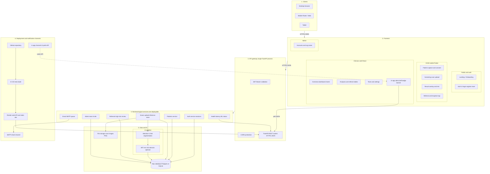

# CarotidCheck system architecture

This document presents a **comprehensive layered view** similar to typical healthcare platform diagrams: **Clients → Frontend (grouped by role) → API gateway → Backend services → Data & AI → Deployment and notification channels**. CarotidCheck ships as **one FastAPI process** and **two client apps** (Flutter + React); the diagram shows **logical** services and flows, not separate microservice containers.

---

## System architecture diagram (comprehensive)

**Rendered SVG:** [architecture.svg](architecture.svg) — open in the browser, print, or embed in slides/thesis.

Regenerate locally (requires network):

```bash
curl -sS -X POST "https://kroki.io/mermaid/svg" -H "Content-Type: text/plain" \
  --data-binary @docs/architecture.mmd -o docs/architecture.svg
```

**Mermaid source:** [architecture.mmd](architecture.mmd).



---

## Layer-by-layer reference (aligned to the diagram)

| Layer | Role | CarotidCheck implementation |
|-------|------|-----------------------------|
| **1. Clients** | Desktop, mobile, tablet access | **Flutter** (iOS, Android, Web) for CHW; **browser** for clinician dashboard (React/Vite). |
| **2. Frontend** | UX by persona | **Public/auth:** onboarding, login, register, forgot/reset password. **CHW:** patient capture, consent, scan, result with overlay, referral/hospital map. **Clinician web:** overview charts, analyses/referrals tables, team/settings, **in-app bell/badge/banner** (`PendingReferralsContext`). **Admin:** accounts / org roster (mobile + web team page). |
| **3. API gateway** | Security + routing | **JWT** (`Bearer` on protected routes), **CORS** (env-driven origins), **FastAPI** routers under `backend/routers/`, OpenAPI at `/docs`. |
| **4. Backend** | Business logic (logical modules) | **Auth:** `auth.py`. **Patients:** `patients.py`. **Scans:** `scans.py` (upload, inference, lists, review). **Referrals:** high-risk and review fields on `Scan`. **Admin:** team, mobile registrations, invite. **Email:** `email_service.py` + optional `alert_queue.py`. **Observability:** `/health`, `/ml-status`, `/latency`. |
| **5. Data & AI** | Persistence + models | **Files:** `uploads/` scan images. **DB:** SQLAlchemy → PostgreSQL (prod) or SQLite (dev). **AI:** Attention U-Net (`ML/AttentionUNet.keras`), `inference.py` → IMT, risk, overlay, optional NASCET stenosis. |
| **6. Deployment & channels** | Release + how users get notified | **GitHub** → **CI/CD** (tests/build) → **Render** (API + static dashboard). **In-app:** client polls **`GET /scans/high-risk`**; no SMS. **SMTP:** referral / CHW ID / password reset when configured. |

---

## Key connections (flows)

| From | To | Protocol / mechanism |
|------|-----|----------------------|
| Clients | Frontend | **HTTPS / JSON** (REST); Flutter uses configured `API_BASE_URL`. |
| Frontend | API gateway | **HTTPS / JSON**; JWT on protected routes. |
| In-app UI | API | **Polling** (`~45s`) to `GET /scans/high-risk?review_status=pending`; optional browser `Notification` if enabled in Settings. |
| Scan service | File storage | **Write** PNG after upload (`POST /scans/upload`). |
| Scan service | Database | **Insert** `Scan`, `Result`, link to `Patient`. |
| Scan service | AI pipeline | **In-process** TensorFlow inference (`inference.py`). |
| Email service | SMTP | **TLS** to provider (e.g. Gmail); queued retries when `alert_queue` enabled. |
| Source | Hosting | **Git** push → CI → **Render** build/start commands. |

---

## Mapping to reference-style diagrams (generic → CarotidCheck)

| Generic block (example diagram) | CarotidCheck |
|----------------------------------|--------------|
| Screening UI | CHW scan + result screens; analyses list on web. |
| Biopsy3D / Video UI | *Not in scope* — ultrasound **frame upload** only (no WebRTC). |
| Admin panel | Web **Team** + Settings; mobile **Accounts** (admin). |
| Prescription / case | **Patients** + **Scans** + **Results**; clinician **review** on scan. |
| Recommendation / scheduling | **Risk stratification** in inference; **referral** workflow; no separate scheduler product. |
| Twilio SMS | **Not used.** Replaced by **in-app** notifications + optional **SMTP**. |
| Model mgmt | `ML/` checkpoint + `inference.py`; `/ml-status` for readiness. |

---

## What is intentionally different from a full microservice diagram

- **Single deployable API** — not one container per “service”; boundaries are **modules** and routers.
- **No WebRTC** — no live video path; imaging is **upload + process**.
- **AI** runs **in the API process** (or stubbed with `requirements-api.txt`), not a separate GPU cluster unless you scale out later.

---

## Data flow (happy path)

1. **CHW** uses **Auth UI** → JWT from **`/auth/login`** or **`/auth/register`**.
2. **Patient** → **`POST /patients`** → **DB**.
3. **Scan** → **`POST /scans/upload`** → **file storage** + **U-Net** → **Result** in **DB**.
4. **Clinician** → **web dashboard** → **in-app** notifications (poll **high-risk**) + tables (**with-results**).
5. **High risk** → optional **SMTP** email; **in-app** remains primary for visibility when logged in.

---

## Related docs

- [System requirements](system-requirements.md) — FR/NFR alignment.
- Root [README.md](../README.md) — API tables, folder layout, run instructions.
