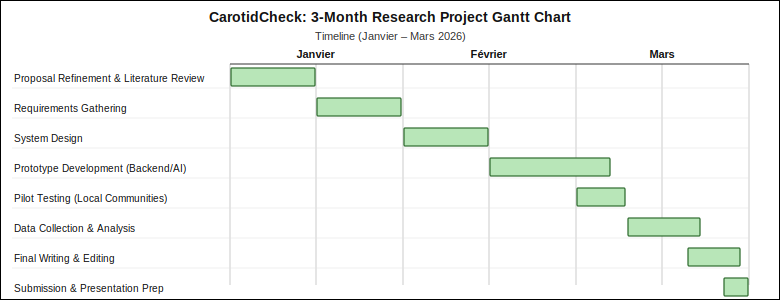

# CHAPTER ONE: INTRODUCTION

## 1.1 Introduction and Background

The medical usage of the word "stroke" dates back to the 16th century, derived from the Middle English *strok*, meaning a "sudden blow" or "a strike of God's hand" (Pound et al., 1997). This etymology reflects the historical perception of the condition as an unpredictable, forceful attack that arrives without warning. However, modern clinical science has shifted this narrative from a "sudden blow" to a preventable vascular event. In the context of software engineering, this shift is empowered by predictive algorithms and real-time monitoring, turning a "sudden" event into a data-driven, manageable health risk.

Globally, stroke is a leading cause of mortality and long-term disability, accounting for approximately 12.2 million cases annually (WSO, 2022). In Africa, the prevalence is rising disproportionately, with stroke accounting for nearly 15% of all non-communicable disease deaths; this crisis is further magnified in Rwanda, where stroke has escalated from the 7th to the 3rd leading cause of death in just one decade (RBC, 2023). While 18% of Rwandan adults over 40 are at high risk due to hypertension, the median time from symptom onset to hospital arrival remains critically high at 72 hours—far beyond the life-saving 4.5-hour "Golden Hour" required for effective clinical intervention (Nkusi et al., 2017).

Traditionally, stroke interventions in Rwanda have relied on hospital-based imaging (CT/MRI) and manual awareness campaigns centered on the FAST protocol (Face, Arm, Speech, Time). While valuable, these traditional methods face significant limitations in rural areas where specialized neurologists are scarce and diagnostic hardware is centralized in urban hubs. Software-driven approaches, specifically Cloud-Integrated Computer Vision, provide a rupture with these static methods. By deploying high-performance models such as Vision Transformers (ViT) and advanced preprocessing pipelines including CLAHE (Contrast Limited Adaptive Histogram Equalization) for contrast enhancement and Wavelet Transforms (DWT) for frequency-domain denoising—a smartphone can now facilitate objective biomarker identification.

This research proposes the development of StrokeLink, a platform that bridges the "Treatment Vacuum" by synthesizing traditional medical knowledge with a cloud-synchronized referral ecosystem. By utilizing the Common Carotid Artery Ultrasound dataset (Momot, 2022), StrokeLink enables the automated measurement of Intima-Media Thickness (IMT), a validated precursor to stroke—via a centralized FastAPI backend. This ensures that clinical-grade diagnostic capabilities and proactive risk stratification are accessible regardless of the geographical setting, seamlessly connecting community screening with immediate hospital-side response.

## 1.2 Problem Statement

In Rwanda, stroke has rapidly ascended to the 3rd leading cause of mortality, accounting for approximately 11% of national deaths (RBC, 2023). Despite this, a catastrophic "Treatment Vacuum" exists, where the median time from symptom onset to hospital arrival is 72 hours—far exceeding the critical 4.5-hour "Golden Hour" (Nkusi et al., 2017). This delay is driven by two primary factors: the lack of objective diagnostic tools at the community level and the fragmented nature of the clinical referral chain.

Current digital health interventions attempt to address this, but they face significant technical limitations. The two closest solutions to the proposed research are:

**The PINGS Trial (Sarfo et al., 2018):** This mobile health intervention was developed to improve blood pressure control and stroke management among survivors in Ghana. While highly effective as a nurse-guided tool for secondary prevention, it focuses primarily on physiological management (blood pressure monitoring) rather than objective biometric analysis. Like many current mHealth solutions, it lacks the ability to detect internal, pre-clinical biomarkers such as Intima-Media Thickness (IMT) that precede an acute event. Consequently, it remains a reactive or management-focused tool rather than a predictive diagnostic solution.

**The Stroke Riskometer™ (Feigin et al., 2015):** A globally recognized app that uses a weighted algorithm of lifestyle factors (age, blood pressure, diet) to predict a 5-to-10-year stroke risk. However, this solution falls short in the Rwandan rural context because it is a static, self-reporting tool. It does not integrate real-time medical imaging and is not linked to a localized referral ecosystem that can alert a specific hospital in a specific district like Gasabo.

The primary gap addressed by this research is the absence of an integrated, image-driven predictive system that bridges the community and the hospital. While the PINGS trial is reactive and the Riskometer is purely algorithmic, StrokeLink introduces a specialized Cloud-Integrated pipeline. By utilizing CLAHE (Contrast Limited Adaptive Histogram Equalization) for enhancement and Wavelet Transforms (DWT) to feature-engineer carotid ultrasound images from the Momot (2022) dataset, this software automates the measurement of IMT with high precision.

The core issue is not just a lack of awareness, but a "blind spot" in technology: the inability to see internal artery risks and send that data to a hospital in real-time. StrokeLink fixes this by turning a normal smartphone into a powerful diagnostic tool. It turns "invisible" artery data into a live alert for doctors.

## 1.3 Project's Main Objective

The overall aim of this project is to develop StrokeLink, a cloud-integrated software solution that compares Vision Transformer (ViT) and Attention U-Net architectures for carotid artery segmentation, selects the best-performing model for deployment, and pairs it with a specialized image-processing pipeline incorporating CLAHE and Wavelet Transforms. This system aims to automate the measurement of carotid Intima-Media Thickness (IMT) to provide objective community-level screening, thereby bridging the 72-hour "Treatment Vacuum" and enabling high-risk individuals in Rwanda to enter the life-saving 4.5-hour "Golden Hour" window.

### 1.3.1 List of the Specific Objectives

1. **To review literature and establish technical baselines:**
   Conduct a comprehensive analysis of state-of-the-art literature regarding the fusion of Vision Transformers (ViT) and U-Net structures for medical segmentation. This involves extracting clinical "Ground Truth" parameters from the Momot (2022) dataset to establish the mathematical thresholds for high-risk IMT levels (e.g., IMT ≥ 0.9 mm) and defining the requirements for frequency-domain denoising.

2. **To develop the StrokeLink cloud-integrated solution:**
   Design and implement a multi-stage software architecture consisting of:
   - An Image-Processing Engine that applies CLAHE (Contrast Limited Adaptive Histogram Equalization) for contrast enhancement and Discrete Wavelet Transforms (DWT) for noise reduction.
   - A FastAPI Backend hosting the selected segmentation model (after comparative evaluation of ViT and Attention U-Net) to perform high-precision automated carotid artery segmentation.
   - A Mobile Interface for Community Health Workers (CHWs) to upload scans and receive real-time, cloud-synchronized risk stratification and referral alerts.

3. **To verify and validate results based on measurable metrics:**
   Collect and evaluate the system's performance using both technical and problem-centric metrics. This verification process will determine if the software effectively reduces diagnostic subjectivity and accelerates the referral of high-risk patients to specialized care.

## 1.4 Research Questions

To guide the development of StrokeLink and see how well it works in Rwanda, this research will answer these three questions:

1. How can we compare Vision Transformer (ViT) and Attention U-Net models, together with CLAHE and DWT (image cleaning tools), to measure the artery wall very accurately, even when ultrasound photos are taken in poor lighting in rural Rwandan villages?

2. Does using a cloud-based system to measure Carotid IMT (artery thickness) give a better warning for stroke than the simple "FAST" checklist (looking for face drooping or slurred speech) that community workers in Rwanda currently use?

3. How does a centralized online dashboard change how fast doctors in Kigali can make decisions? Can this technology help reduce the current 72-hour delay to get patients to the hospital within the life-saving 4.5-hour "Golden Hour"?

## 1.5 Project Scope

The pilot phase will be conducted within the Gasabo District of Kigali, specifically focusing on the Kimironko and Bumbogo sectors. This selection provides a representative sample of Rwanda's population by including an urban environment and a peri-urban/rural environment to test how the software performs with different internet speeds and environmental lighting conditions. This study is scheduled for a duration of three months, spanning from January 2026 to March 2026, allowing for a focused phase of technical validation and software deployment.

Testing will involve a controlled group of 30 to 50 participants aged 40 and above, representing the primary high-risk demographic for stroke in Rwanda. The software will be operated by 5 Community Health Workers (CHWs) or health post staff, with results monitored via an online dashboard by 2 to 3 clinicians in Kigali to verify the referral process. This focused human-centric scope ensures that the 3-month implementation phase remains realistic and manageable.

Technically, the project focuses on automated Intima-Media Thickness (IMT) measurement using carotid ultrasound images. To ensure scientific validity without requiring expensive medical hardware, testing will be done using the Momot (2022) dataset and simulated mobile input, where ultrasound images are processed as if captured by a live probe. The backend compares ViT and Attention U-Net for segmentation, deploys the stronger model for inference, and uses CLAHE and DWT for image cleaning, focusing strictly on diagnostic accuracy and real-time referral alerts rather than full-scale hospital management systems.

## 1.6 Significance and Justification

The successful implementation of StrokeLink will fundamentally transform stroke triage in Rwanda by replacing subjective, manual checklists with objective, AI-driven biomarkers. By automating Carotid IMT measurement, the software provides community health posts in peri-urban areas like Bumbogo with diagnostic capabilities previously reserved for specialized Kigali hospitals. This effectively democratizes high-level neurological screening, ensuring that a patient's location does not determine their access to life-saving diagnostics.

Technically, this project demonstrates that Vision Transformer and Attention U-Net architectures can function reliably over limited digital infrastructure when appropriately compared and selected. By utilizing CLAHE and Discrete Wavelet Transforms (DWT) to mitigate the issue of low-quality ultrasound images, the study justifies a "Cloud-First" approach to medical technology. It proves that high-performance AI can be delivered to low-resource settings without the need for expensive, localized hardware, offering a scalable blueprint for digital health interventions across Sub-Saharan Africa.

Ultimately, this software directly addresses the catastrophic 72-hour delay in stroke care by establishing a real-time digital referral bridge. By synchronizing diagnostic data between community health workers and urban specialists, StrokeLink facilitates patient entry into the critical 4.5-hour "Golden Hour." This shift is expected to significantly reduce long-term disability and mortality rates, positioning Rwanda as a leader in AI-driven clinical triage for non-communicable diseases.

## 1.7 Research Budget

| Item / Service | Description | Estimated Cost (USD) |
|----------------|-------------|----------------------|
| Cloud Hosting (FastAPI) | Hosting the backend and deployed segmentation model (TensorFlow/Keras, ViT vs. Attention U-Net pipeline) using the Render Free Tier with an optimized "Lite" stack where applicable. | $0 (Free Tier) |
| Mobile App Backend | Development and deployment of the FastAPI interface to manage mobile requests. | $0 (Open Source) |
| Cloud Database | Managed database service (e.g., Supabase or Firebase) for real-time patient data synchronization. | $0 (Free Tier) |
| Email notifications (SMTP) | Referral and account emails via configured SMTP (e.g. Gmail); no third-party SMS gateway in scope. | $0 |
| UI/UX Design Tool | Professional mobile interface prototyping and wireframing using Figma. | $0 (Free Tier) |
| Logistics & Field Testing | Transport, mobile data bundles (MTN/Airtel), translation services, and participant stipends in Kimironko and Bumbogo. | $135 |
| Miscellaneous | Contingency fund for unexpected technical requirements, hardware maintenance, or API overages. | $90 |

**Total Estimated Cost: $250**

## 1.8 Research Timeline

*See Figure 1.1: CarotidCheck 3-Month Research Project Gantt Chart (Janvier–Mars 2026).*

