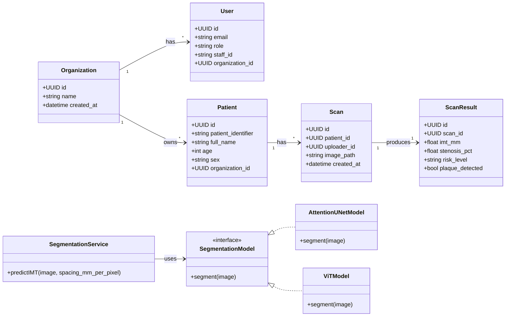
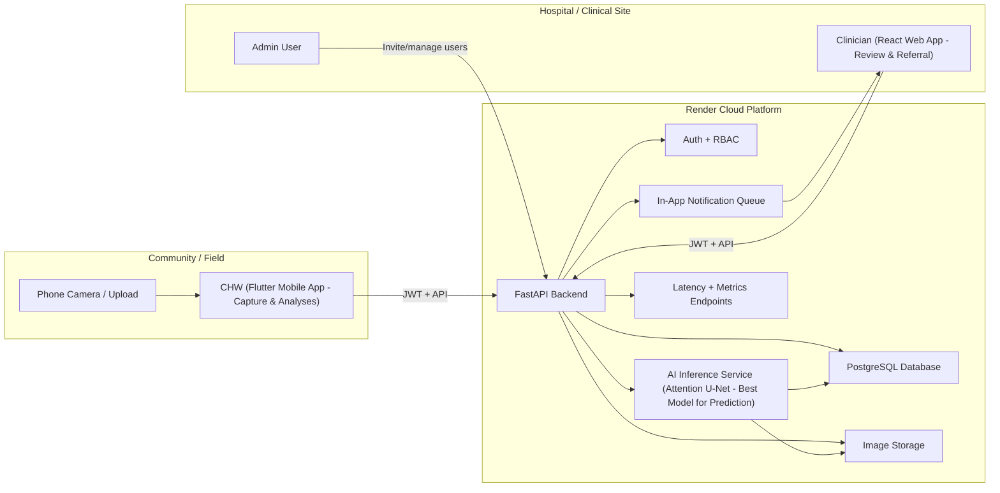
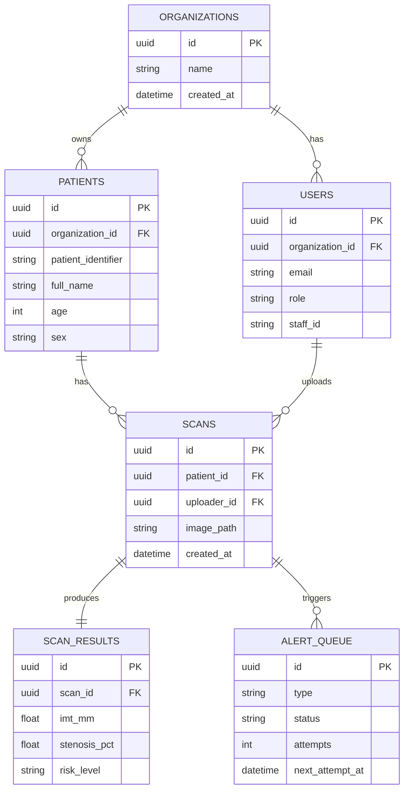
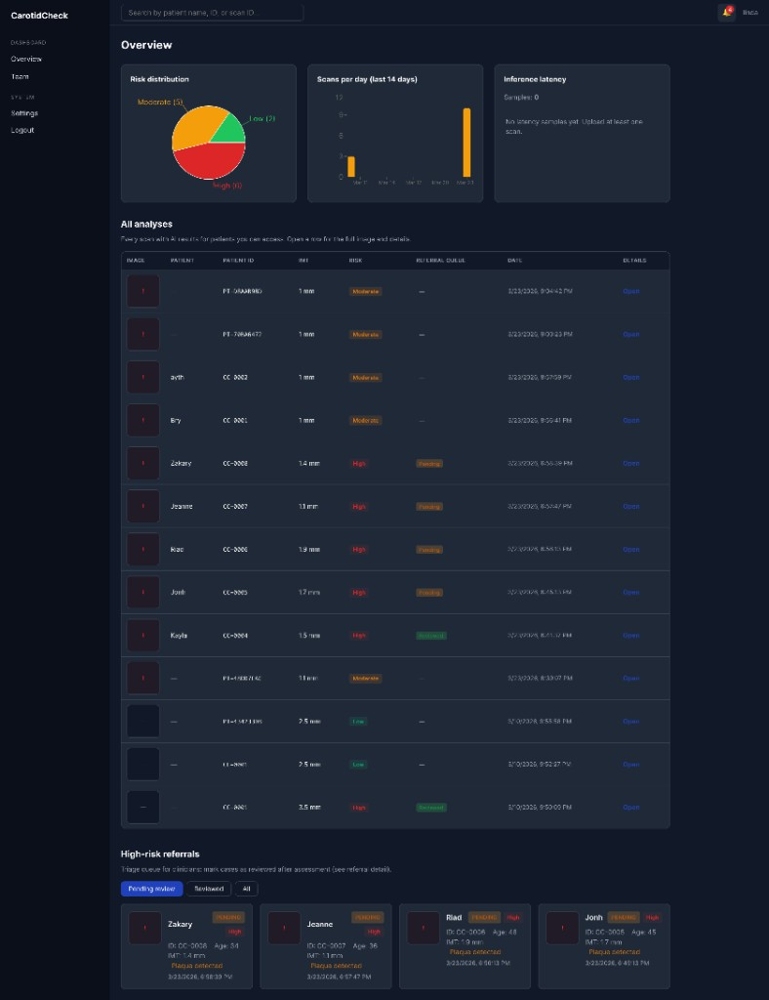
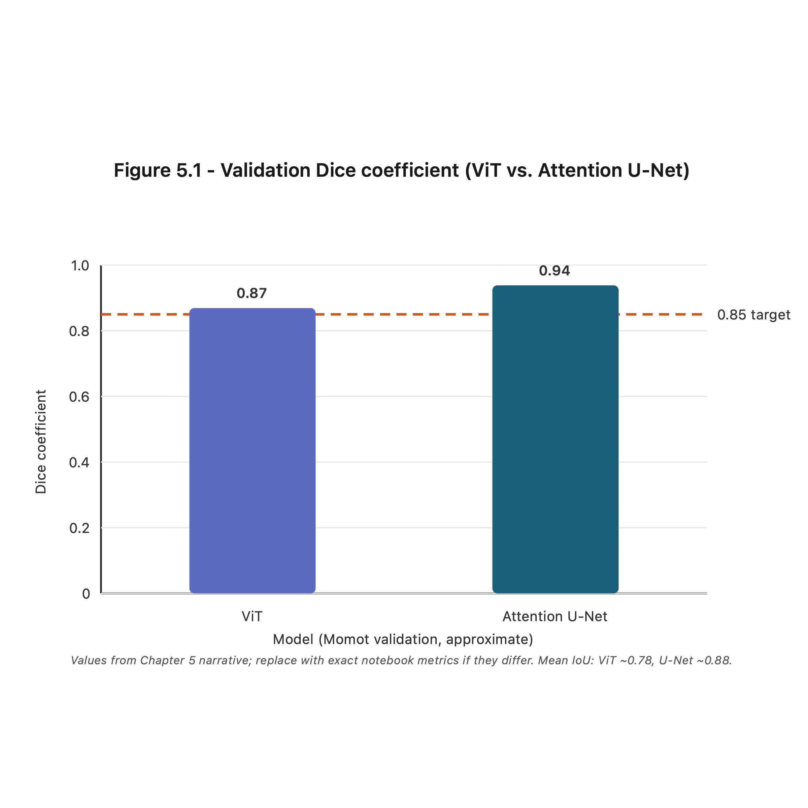
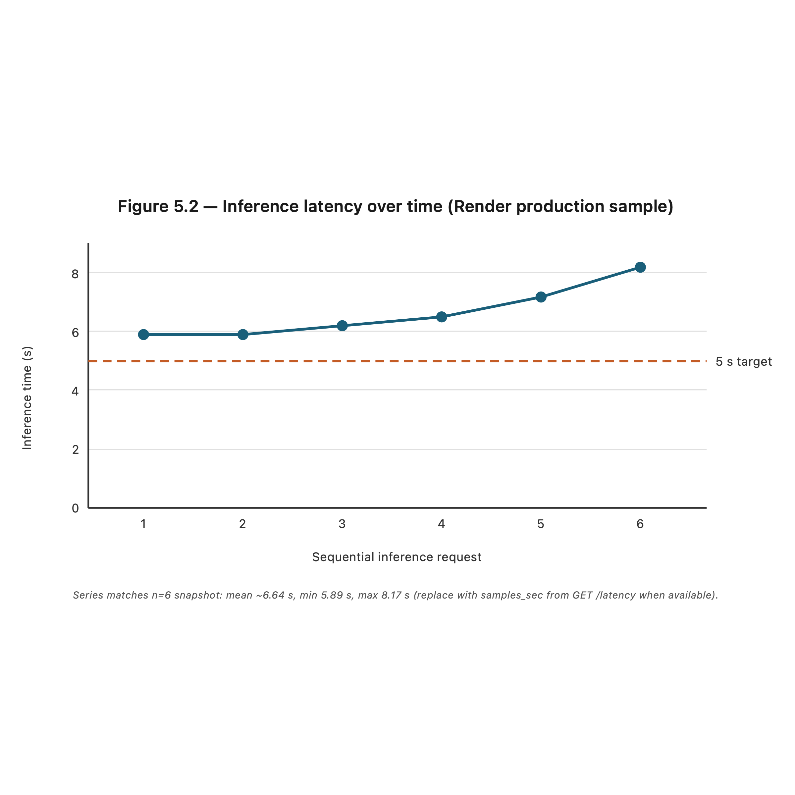
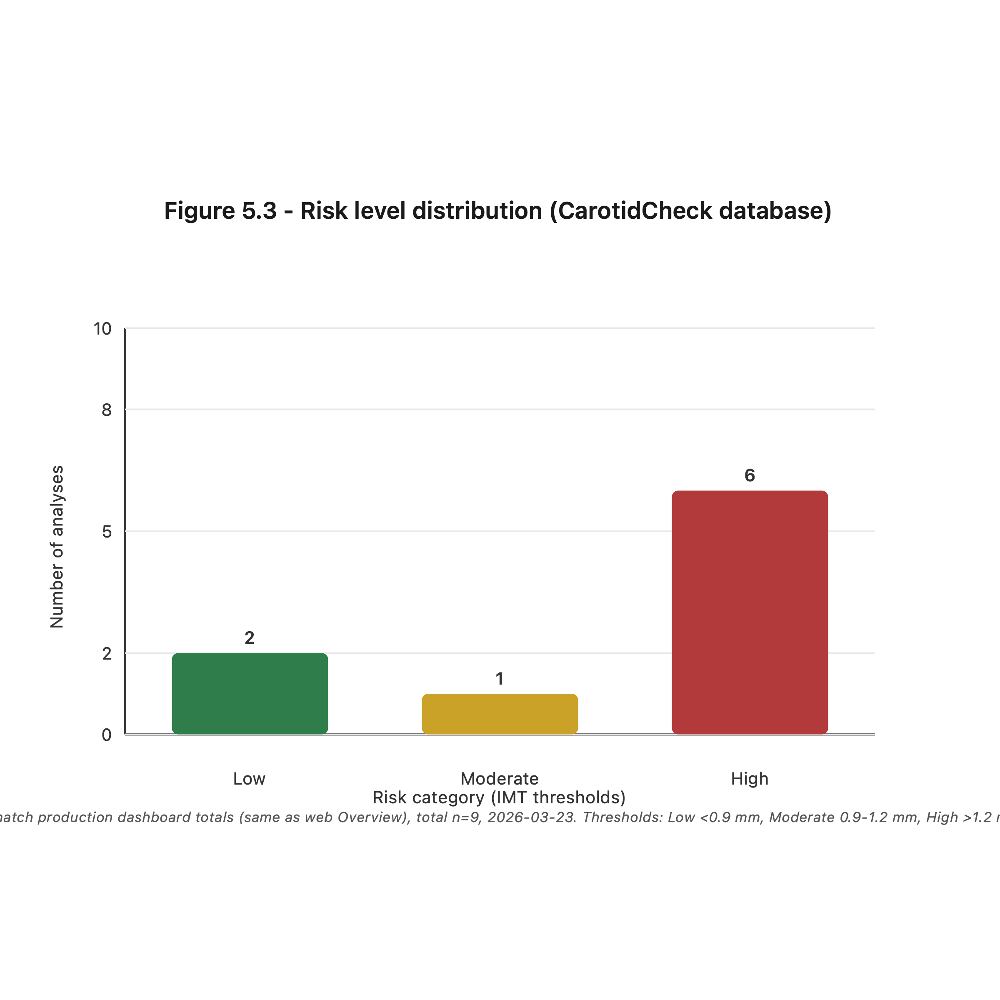

# CarotidCheck: AI-Driven Carotid Ultrasound Analysis for Enhanced Stroke Triage in Rwanda

---

## Cover page *(institutional template — use one page in Word/PDF)*

| Field | Text |
|--------|------|
| **Project title** | CarotidCheck: AI-Driven Carotid Ultrasound Analysis for Enhanced Stroke Triage in Rwanda |
| **Student name** | Bio Bogore Gnon Deolinda |
| **Program** | Bachelor of Software Engineering, African Leadership University, Kigali, Rwanda |
| **Supervisor** | Tunde Isiaq Gbadamosi |
| **Submission date** | January 2026 |

---

## DECLARATION

I, Gnon Deolinda Bio Bogore, declare that this **capstone project report** is my original work, except where otherwise stated, and that all external sources have been properly acknowledged and cited. This work has not been submitted for the award of any degree or for any similar purpose at any other university or institution.

**Deolinda Bio Bogore**  
07/03/2026

---

## CERTIFICATION

The undersigned certifies that he has read and hereby recommended for acceptance of African Leadership University a report entitled *CarotidCheck: AI-Driven Carotid Ultrasound Analysis for Enhanced Stroke Triage in Rwanda*.

Signature ………………………………  Date ………………………………  

Prof/Dr./Mrs./Miss/Mr. Name of the Supervisor  

Faculty, Bachelor of Software Engineering, ALU

---

## DEDICATION AND ACKNOWLEDGEMENT

**Dedication**  
*(Optional: one short paragraph—for example, to family, community health workers, or patients who inspired the work.)*

**Acknowledgement**  
I sincerely thank my supervisor, **Tunde Isiaq Gbadamosi**, for guidance throughout this capstone. I am grateful to African Leadership University and to everyone who provided feedback, technical support, or access to resources that made CarotidCheck possible. *(Add names of reviewers, peers, or clinicians if applicable.)*

---

## Abstract

Stroke has become the third leading cause of death in Rwanda, with a median time from symptom onset to hospital arrival of 72 hours, far exceeding the critical 4.5-hour window for effective intervention. This “treatment vacuum” is driven by the lack of objective diagnostic tools at the community level and a fragmented referral chain. **Objectives** were to compare deep learning architectures for carotid segmentation, deploy the best model in a community-to-hospital workflow, and evaluate technical performance and referral visibility for clinicians. **Methodology** followed iterative Agile sprints: preprocessing and training on the Momot (2022) dataset, model comparison (ViT vs. Attention U-Net), integration into a FastAPI backend with PostgreSQL, a Flutter app for community health workers, a React web dashboard for clinicians, and structured testing from unit through acceptance. This research **proposed and implemented CarotidCheck**, a cloud-integrated solution that automates carotid artery segmentation and Intima-Media Thickness (IMT) measurement from ultrasound images. The system evaluated both architectures on Momot (2022), selecting Attention U-Net for deployment due to superior validation performance (Dice ~0.94, Mean IoU ~0.88). CarotidCheck provides dual-layer diagnostics—early-stage risk (IMT) and advanced blockage (stenosis). **Clinician awareness of pending high-risk referrals is provided in the web dashboard** through an in-app notification bell and badge: the dashboard calls the backend API on a timer and counts pending high-risk cases. On the deployed stack, inference latency can exceed the 5 s design target under free-tier cloud hosting (Chapter Five). **Conclusions:** CarotidCheck can support objective, image-driven stroke triage at the community level, aligned with Rwanda’s Ministry of Health 4×4 Reform. **Recommendations** include field pilot validation, lumen segmentation for direct stenosis calculation, and integration of ultrasound metadata for improved IMT calibration.

**Keywords:** Carotid ultrasound, Intima-Media Thickness, carotid triage, Attention U-Net, Vision Transformer, Rwanda, cloud-integrated diagnostics, NASCET

---

## Table of Contents

*Page numbers below match your **Word** automatic Table of Contents (**body pages 1–39**). Front matter (title page, declaration, certification, abstract, lists) uses your template’s numbering separately. **References → Table of Contents → Update** after edits. An older Turnitin PDF used different pagination; treat **Word** as authoritative for submission.*

**CHAPTER ONE: INTRODUCTION** — **p. 1–9**

| Section | p. |
|---------|--|
| 1.1 Introduction and Background | 1 |
| 1.2 Problem Statement | 4 |
| 1.3 Project’s Main Objective | 5 |
| 1.3.1 Specific Objectives | 5 |
| 1.4 Research Questions | 6 |
| 1.5 Project Scope | 6 |
| 1.6 Significance and Justification | 8 |
| 1.7 Research Budget | 8 |
| 1.8 Research Timeline | 9 |

**CHAPTER TWO: LITERATURE REVIEW** — **p. 10–17**

| Section | p. |
|---------|--|
| 2.1 Introduction | 10 |
| 2.2 Historical Background of the Research Topic | 10 |
| 2.3 Overview of Existing Systems | 12 |
| 2.4 Review of Related Work | 13 |
| 2.4.1 Summary of Reviewed Literature | 14 |
| 2.5 Strengths and Weaknesses of Existing Systems | 15 |
| 2.6 General Comments | 17 |

**CHAPTER THREE: SYSTEM ANALYSIS AND DESIGN** — **p. 18–23**

| Section | p. |
|---------|--|
| 3.1 Introduction | 18 |
| 3.2 Research Design (including SDLC model) | 18 |
| 3.2.1 Dataset and Dataset Description | 19 |
| 3.3 Functional and Non-Functional Requirements | 20 |
| 3.4 Proposed Model Diagram | 21 |
| 3.5 System Architecture | 21 |
| 3.6 Flow Chart, Use Case Diagram, Sequence Diagram and Others | 22 |
| 3.7 Development Tools | 23 |

**CHAPTER FOUR: SYSTEM IMPLEMENTATION AND TESTING** — **p. 24–30**

| Section | p. |
|---------|--|
| 4.1 Implementation and Coding | 24 |
| 4.1.1 Introduction | 24 |
| 4.1.2 Description of Implementation Tools and Technology | 24 |
| 4.2 Graphical View of the Project | 25 |
| 4.2.1 Screenshots with Description | 25 |
| 4.3 Testing | 28 |
| 4.3.1 Introduction | 28 |
| 4.3.2 Objective of Testing | 28 |
| 4.3.3 Unit Testing Outputs | 28 |
| 4.3.4 Validation Testing Outputs | 29 |
| 4.3.5 Integration Testing Outputs | 29 |
| 4.3.6 Functional and System Testing Results | 30 |
| 4.3.7 Acceptance Testing Report | 30 |

**CHAPTER FIVE: DESCRIPTION OF THE RESULTS / SYSTEM** — **p. 31–35**

| Section | p. |
|---------|--|
| 5.1 Description of Results | 31 |
| 5.1.1 Model Comparison Results (ViT vs. Attention U-Net) | 31 |
| 5.1.2 Inference Latency | 32 |
| 5.1.3 Risk Level Distribution | 33 |
| 5.2 Discussion | 34 |
| 5.2.1 Connection to Research Questions | 34 |
| 5.2.2 Implications | 35 |
| 5.2.3 Limitations | 35 |

**CHAPTER SIX: CONCLUSIONS AND RECOMMENDATIONS** — **p. 36–38**

| Section | p. |
|---------|--|
| 6.1 Conclusions | 36 |
| 6.2 Recommendations | 37 |
| 6.2.1 For Field Pilot Validation | 37 |
| 6.2.2 For Technical Improvement | 37 |
| 6.2.3 For Future Research | 38 |
| 6.3 Limitations of the Study | 38 |

**REFERENCES** — **p. 39**

---

## List of Tables

| Table | Title / location | p. |
|-------|------------------|--|
| *(inline)* | Development tools listing (§3.7) | 23 |
| *(inline)* | Key implementation modules (§4.1.2) | 24 |

*(In Word, use Insert → Caption for formal “Table X” labels and refresh page numbers.)*

---

## List of Figures

| Figure | Title | p. |
|--------|-------|--|
| 1.1 | Project Gantt Chart and Research Timeline | 9 |
| 3.1 | CarotidCheck UML Class Diagram | 21 |
| 3.2 | Client-Server Architecture | 21 |
| 3.3 | CarotidCheck Entity-Relationship Diagram (ERD) | 22 |
| 4.1 | Registration Screen | 25 |
| 4.2 | Dashboard | 25 |
| 4.3 | Patient Registration | 26 |
| 4.4 | Scan Capture | 26 |
| 4.5 | Analysis Result | 27 |
| 4.6 | Analyses and Referrals | 27 |
| 4.7 | Clinician Web Dashboard | 27 |
| 5.1 | Validation Dice Coefficient (ViT vs. Attention U-Net) | 31 |
| 5.2 | Inference Latency Over Time | 32 |
| 5.3 | Risk Level Distribution | 33 |

*(Figure pages align with §1.8 and Chapter 4–5 sections in your **Word** TOC; adjust if a figure moves to the next page.)*

---

## List of Acronyms/Abbreviations

| Acronym | Meaning |
|--------|---------|
| AI | Artificial Intelligence |
| API | Application Programming Interface |
| CCA | Common Carotid Artery |
| CHW | Community Health Worker |
| CLAHE | Contrast Limited Adaptive Histogram Equalization |
| CNN | Convolutional Neural Network |
| CV | Computer Vision |
| ERD | Entity-Relationship Diagram |
| FAST | Face, Arm, Speech, Time (Stroke Assessment Protocol) |
| HTTPS | Hypertext Transfer Protocol Secure |
| IDE | Integrated Development Environment |
| IMT | Intima-Media Thickness |
| IoU | Intersection over Union (Jaccard Index) |
| JSON | JavaScript Object Notation |
| MAE | Mean Absolute Error |
| NASCET | North American Symptomatic Carotid Endarterectomy Trial |
| POCUS | Point-of-Care Ultrasound |
| RBC | Rwanda Biomedical Centre |
| REST | Representational State Transfer |
| ROI | Region of Interest |
| SLR | Systematic Literature Review |
| UML | Unified Modeling Language |
| ViT | Vision Transformer |
| WHO | World Health Organization |

---

# CHAPTER ONE: INTRODUCTION

## 1.1 Introduction and Background

The medical usage of the word "stroke" dates back to the 16th century, derived from the Middle English *strok*, meaning a "sudden blow" or "a strike of God's hand" (Pound et al., 1997). This etymology reflects the historical perception of the condition as an unpredictable, forceful attack. Modern clinical science, however, has reframed stroke as a preventable vascular event. In software engineering, this shift is enabled by predictive algorithms and real-time monitoring, transforming a "sudden" event into a data-driven, manageable health risk.

Globally, stroke is a leading cause of mortality and long-term disability, accounting for approximately 12.2 million cases annually (Feigin et al., 2025). In Africa, the prevalence is rising disproportionately, with stroke accounting for nearly 15% of all non-communicable disease deaths. In Rwanda, stroke has risen from the 7th to the 3rd leading cause of death in the last decade (Dushimiyimana et al., 2022). While 18% of Rwandan adults over 40 are at high risk due to hypertension, the median time from symptom onset to hospital arrival remains critically high at 72 hours—far beyond the 4.5-hour "Golden Hour" necessary for effective clinical intervention (Nkusi et al., 2017).

Traditionally, interventions relied on hospital-based imaging (CT/MRI) and public awareness campaigns such as the FAST protocol (Face, Arm, Speech, Time). While valuable, these approaches face limitations in rural areas where neurologists are scarce and diagnostic equipment is centralized in urban hospitals (Liu et al., 2024). Cloud-integrated computer vision offers a transformative alternative. By deploying high-performance models such as Vision Transformers (ViT) and Attention U-Net, along with preprocessing pipelines using padding, resizing, and Albumentations-based augmentation, smartphones can now support objective biomarker identification from carotid ultrasound images.

This research proposed **CarotidCheck**, a platform bridging the "Treatment Vacuum" by combining traditional medical knowledge with a cloud-synchronized referral ecosystem. Using the Common Carotid Artery Ultrasound dataset (Momot, 2022), CarotidCheck segments carotid artery walls, automates Intima-Media Thickness (IMT) measurement, and surfaces high-risk cases to clinicians **via the web dashboard** through API-polled in-app notifications (bell and badge counting pending referrals)—demonstrating an end-to-end path from community screening to hospital response.

## 1.2 Problem statement

Stroke has become the 3rd leading cause of mortality in Rwanda, accounting for approximately 5.4% of national deaths (Dushimiyimana et al., 2022). Despite this, a “Treatment Vacuum” exists: the median time from symptom onset to hospital arrival is 72 hours, far exceeding the critical 4.5-hour "Golden Hour" (Nkusi et al., 2017). This delay arises primarily from the absence of objective diagnostic tools at the community level and a fragmented clinical referral chain.

Existing digital health interventions have limitations. The PINGS Trial (Sarfo et al., 2018) focuses on physiological management rather than objective imaging biomarkers and cannot detect pre-clinical signs like IMT. The Stroke Riskometer™ (Feigin et al., 2015) is a self-report tool lacking real-time medical imaging integration and is not connected to a localized referral network.

The primary gap addressed by this research is the absence of an integrated, image-driven predictive system that links community health posts to hospitals. CarotidCheck addresses this gap by automating carotid artery segmentation and IMT measurement with high precision, supporting timely referral and early intervention.

## 1.3 Project’s main objective

The main objective of this project was to develop CarotidCheck, a cloud-integrated software solution that compares two deep learning architectures—Vision Transformer (ViT) and Attention U-Net—for carotid artery segmentation. The best-performing model was deployed to provide objective community-level screening and reduce delays in stroke detection and referral.

### 1.3.1 List of the specific objectives

1. **Literature review and technical baseline:** Analyze state-of-the-art methods for ViT and Attention U-Net medical segmentation using the Momot (2022) dataset and define evaluation metrics (Dice coefficient, Jaccard Index, F1 score, Mean IoU).

2. **Develop the CarotidCheck system:** Design and implement a cloud-integrated pipeline including preprocessing, model comparison, segmentation, IMT, risk classification, and FastAPI backend with Flutter mobile interface for CHWs.

3. **Validation and evaluation:** Assess system performance using technical metrics and problem-centered evaluation to determine effectiveness in reducing subjectivity and accelerating high-risk patient referrals.

## 1.4 Research questions

1. How can Vision Transformer (ViT) and Attention U-Net architectures be compared to measure artery walls accurately from carotid ultrasound images, even under poor lighting in rural Rwandan settings?

2. Does cloud-based IMT measurement provide better stroke warning than the current FAST checklist used by community health workers?

3. How does a centralized online dashboard affect decision-making speed for doctors in Kigali, and can it help reduce the current 72-hour delay?

## 1.5 Project scope

The pilot phase was conducted in Gasabo District, Kigali, focusing on Kimironko (urban) and Bumbogo (peri-urban/rural) sectors. This selection provides a representative sample of Rwanda's population and allows the software to be tested under varying internet speeds and environmental conditions. The study spanned three months (January–March 2026), enabling a focused phase of technical validation and software deployment.

Testing involved 5–10 anonymized clinical images from the Momot (2022) dataset, mapped to digital personas representing residents aged 40 and above—the primary high-risk demographic for stroke in Rwanda. Five proxy users, acting as Community Health Workers (CHWs) or health post staff, operated the software in a simulated field environment, while 2–3 clinicians monitored results via an online dashboard in Kigali to verify the referral workflow. This setup ensured that the pilot remained realistic, manageable, and ethically compliant.

The project focused on automated Intima-Media Thickness (IMT) measurement from carotid ultrasound images. Validation used the Momot (2022) dataset and simulated mobile input, with images processed as if captured live. Preprocessing included padding, resizing to 256×256, and Albumentations-based augmentation.

Both Vision Transformer (ViT) and Attention U-Net architectures were evaluated for carotid segmentation. The system computes IMT from segmented masks, performs risk stratification, and presents results through a Flutter mobile client, a FastAPI backend, and a web dashboard for hospital-side monitoring.

Cloud-integrated storage (PostgreSQL) ensures real-time synchronization between Kimironko, Bumbogo, and Gasabo District Hospital, allowing immediate visibility of high-risk cases. The pilot focused on diagnostic accuracy and simulated referral alerts rather than full-scale hospital management functionality.

## 1.6 Significance and Justification

The successful implementation of CarotidCheck transforms carotid triage in Rwanda by replacing subjective, manual checklists with objective, AI-driven biomarkers. By automating the measurement of carotid Intima-Media Thickness (IMT), the software equips community health posts with diagnostic capabilities that were previously available only in specialized hospitals in Kigali. This approach supports Rwanda's Ministry of Health 4×4 Reform (Rwanda Ministry of Health, 2023), which seeks to empower the health workforce with digital tools to deliver specialized care at the community level.

## 1.7 Research Budget

For this academic project phase, direct software infrastructure spending was **USD $0** because cloud hosting (FastAPI backend, mobile interface support services, PostgreSQL on Render) and UI tooling (Figma) were run on free tiers.

The planned/estimated budget for pilot and scale-ready operation includes:

- **Logistics and field testing** (transport, mobile data bundles, translation, participant stipends): **USD $160** (estimated)
- **Contingency fund** (unexpected technical requirements, hardware maintenance, API overages): **USD $90** (estimated)

## 1.8 Research Timeline

*See Figure 1.1: Project Gantt Chart and Research Timeline (Janvier–Mars 2026).*
# CHAPTER TWO: LITERATURE REVIEW

## 2.1 Introduction

This literature review examines software-driven diagnostics and automated clinical triage architectures for stroke risk assessment. It focuses on Computer Vision (CV) frameworks for carotid artery segmentation, the performance of Vision Transformers (ViT) and Attention U-Net in medical imaging, and the application of FastAPI for low-latency healthcare APIs. Additionally, it includes data-centric studies quantifying Rwanda’s "Treatment Vacuum" and diagnostic delays. A Systematic Literature Review (SLR) methodology was employed, using multi-stage screening to ensure technical relevance to machine learning deployment. Indexed platforms searched include PubMed, Google Scholar, SpringerLink, Elsevier (ScienceDirect), and epidemiological reports from the Rwanda Biomedical Centre (RBC). Key papers identified provide benchmarks for automated Intima-Media Thickness (IMT) measurement and evidence of the 72-hour diagnostic delay in Rwanda.

## 2.2 Historical Background of the Research Topic

Historically, stroke risk assessment via carotid ultrasound relied heavily on manual anatomical observation. In the 1990s, clinicians performed manual tracing of IMT—a process both time-consuming and prone to inter-observer variability. Early software was limited to basic PACS archiving, leaving diagnostic outcomes dependent on the sonographer's subjective judgment. Research from this period established that a 0.16 mm increase in IMT correlated with a 41% higher stroke risk (Bots et al., 1997). However, measurements were inconsistent and limited to high-resource clinical settings.

The 2010s introduced semi-automated software using edge-detection algorithms, such as "Snakes" or Active Contour models. Measurement time dropped from 45 minutes to under 10 minutes, but high-noise images from portable devices still posed challenges. In Rwanda, early digital health initiatives like Babyl (2016) expanded teleconsultation capacity but lacked specialized CV tools for neurological triage (World Economic Forum, 2021). Rural patients continued to experience prolonged delays, contributing to the persistent 72-hour diagnostic gap (Nkusi et al., 2017).

In the past five years, fully automated, cloud-enabled diagnostics have emerged. While CNNs enabled automated Region of Interest (ROI) localization, Vision Transformers (ViTs) and Attention U-Nets now capture global context and subtle textures with higher accuracy. Supported by datasets such as Momot (2022), these architectures form the basis of CarotidCheck, which compares both models for carotid artery segmentation, deploying the best-performing model to generate segmentation masks for IMT calculation. This allows Community Health Workers (CHWs) to conduct real-time, objective stroke risk assessment.

CarotidCheck integrates FastAPI as the backend and Flutter for mobile delivery. FastAPI’s asynchronous processing, combined with Starlette and Pydantic, ensures type-safe, low-latency handling of high-resolution ultrasound images from rural areas, enabling clinical-grade validation in the field.

## 2.3 Overview of Existing System

Current stroke risk assessment tools fall into two categories:

**Clinical mHealth Platforms:** Examples include PINGS (Phone-based Intervention under Nurse Guidance after Stroke), which enables healthcare providers to monitor blood pressure and track stroke symptoms via standardised digital checklists. Its limitations include a reactive approach focusing only on patients who have already experienced a stroke and a lack of automated biometric analysis for pre-clinical detection.

**Global Risk Prediction Tools:** Platforms like Stroke Riskometer™ allow users to input lifestyle data for long-term stroke risk prediction using weighted algorithms. These tools are static and self-reported, lacking integration with real-time medical imaging or district-level referral APIs. Consequently, they cannot address the 72-hour diagnostic delay in rural districts like Gasabo.

While these systems improve awareness and manual triage, they are not designed for image-driven, objective diagnostics suited to Rwanda's rural healthcare infrastructure. CarotidCheck addresses these gaps by enabling automated IMT analysis, risk stratification, and direct referral to healthcare facilities.

## 2.4 Review of Related Work

Spence (2020) provides a comprehensive review of ultrasound in stroke prevention, highlighting that measurements of carotid plaque burden (total plaque area or volume) are stronger predictors of cardiovascular risk than IMT, which represents a biologically distinct phenotype. Despite this, IMT remains a practical first-line measure for early risk stratification. The review supports using carotid ultrasound as an objective, image-driven tool in resource-limited settings, providing a rationale for CarotidCheck's use of IMT derived from automated segmentation masks.

Ottakath et al. (2023) review ultrasound-based image analysis for predicting carotid artery stenosis risk, covering segmentation of plaque and lumen areas, IMT derivation, plaque characterization, and stenosis grading using machine learning and deep learning. Automated approaches reduce human error and variability, directly aligning with CarotidCheck’s pipeline: carotid wall segmentation, IMT calculation, and risk classification using ViT and Attention U-Net.

Megahed et al. (2025) highlight Vision Transformers’ critical role in overcoming the scarcity of labelled medical data through masked autoencoding (MAE). They address domain gaps between general and sonographic images, emphasizing the need for foundation-style encoders to capture global contextual dependencies necessary for robust diagnostics in low-resource settings.

### 2.4.1 Summary of Reviewed Literature

Across the sources above, a consistent theme emerges: **ultrasound-based, automated analysis** (segmentation, IMT, plaque or stenosis cues) can reduce observer variability and support earlier risk detection compared with checklist-only or purely self-reported tools. Reviews by Spence (2020) and Ottakath et al. (2023) justify image-derived biomarkers for triage, while Megahed et al. (2025) motivate modern encoders (e.g. ViT) for noisy, limited-label medical imaging. Together, this body of work supports CarotidCheck’s design choice to combine **deep learning segmentation** with a **connected referral workflow**, addressing gaps left by platforms such as PINGS (physiological follow-up) and Stroke Riskometer™ (lifestyle self-report) that do not perform real-time carotid image analysis or structured referral in rural Rwandan contexts.

## 2.5 Strengths and Weaknesses of the Existing System(s)

The evaluation of existing stroke diagnostic software highlights a significant gap between general risk awareness tools and clinical-grade, image-driven diagnostic platforms. While the former digitize traditional protocols, they cannot function as objective, automated triage solutions in decentralised health settings. Unlike ultrasound-based deep learning approaches discussed in Section 2.4, these systems lack integration with Computer Vision (CV) models for anatomical analysis, such as carotid artery segmentation and Intima–Media Thickness (IMT) measurement.

### The PINGS Trial (Physiological Management Platform)

**Strengths:** PINGS demonstrates clinical feasibility in resource-limited settings, particularly in West Africa. It supports continuous blood pressure monitoring and improves medication adherence, highlighting the potential of mobile health (mHealth) platforms to scale care delivery and support post-stroke management.

**Weaknesses:** PINGS is reactive, focusing on secondary prevention after stroke onset. It lacks an automated biometric analysis engine, meaning it cannot process medical images or extract objective biomarkers such as plaque characteristics or IMT—critical for early, pre-clinical stroke risk detection.

### Stroke Riskometer™ (Lifestyle-Based Platform)

**Strengths:** The Stroke Riskometer™ enables scalable, long-term stroke risk prediction using validated weighted algorithms based on user-reported lifestyle data. It facilitates public health awareness and longitudinal monitoring of behavioral risk factors.

**Weaknesses:** This platform is static and relies on subjective self-reporting, limiting clinical reliability. Unlike modern machine learning pipelines for ultrasound analysis, it does not include segmentation, classification, or plaque characterisation. In rural Rwandan contexts, it is not integrated with local healthcare infrastructure and lacks a real-time referral mechanism. Consequently, it cannot reduce diagnostic delays or support timely clinical intervention based on objective biological evidence.

## 2.6 General Comments

The research and systems reviewed in this chapter highlight a critical gap in current stroke detection approaches, particularly in rural and resource-limited settings. Existing platforms, such as PINGS and the Stroke Riskometer™, primarily rely on self-reported data or observable clinical symptoms like facial drooping. However, these indicators typically emerge only after a stroke has occurred, limiting their effectiveness for early, pre-clinical detection.

Recent advancements in artificial intelligence (AI), particularly in medical image analysis, offer a promising solution. Studies through 2025–2026 (Megahed et al., 2025) show that advanced models, including Vision Transformers (ViTs), can outperform traditional methods in analysing low-quality ultrasound images by capturing global contextual features and reducing noise effects. These models enable accurate, automated extraction of anatomical biomarkers, including carotid artery structure and Intima–Media Thickness (IMT), which are critical for early stroke risk assessment. When trained on curated carotid ultrasound datasets, such systems can achieve precision and consistency comparable to expert clinical evaluation.

The literature thus supports the need for a fast, objective, and connected carotid triage system tailored to decentralised healthcare environments. CarotidCheck addresses this need by integrating AI-driven ultrasound analysis with a cloud-based architecture capable of real-time clinical decision support. By detecting early arterial abnormalities and enabling immediate communication with nearby healthcare facilities, the system shifts stroke care from reactive symptom management to proactive risk detection.

This approach aligns with Rwanda's Ministry of Health 4×4 Reform (Rwanda Ministry of Health, 2023), which emphasizes scaling the healthcare workforce and strengthening primary care through digital innovation. By empowering Community Health Workers with intelligent diagnostic tools, CarotidCheck bridges the gap between advanced medical technologies and underserved populations. This chapter establishes the theoretical and technical foundation for the next chapter, which details the system design and implementation of the proposed solution.

> **Note:** If you cite additional 2026 studies in the final PDF, add full bibliographic entries under References (verify author names and venues—for example, verify Megahed et al. against the final publication rather than placeholder metadata).
# CHAPTER THREE: SYSTEM ANALYSIS AND DESIGN

## 3.1 Introduction

This chapter presents the technical framework and design strategies behind CarotidCheck. The system is engineered to bridge the "Treatment Vacuum" in Rwanda by shifting stroke screening from subjective observation to objective, AI-driven analysis. The design emphasizes a cloud-native architecture, linking community health posts directly to district hospitals for real-time referral and monitoring.

## 3.2 Research Design (including the SDLC model used)

The development of CarotidCheck followed the **Agile Development Model**, divided into four iterative sprints:

- **Phase 1: Sprint One (Data & Preprocessing)** — Collected the Momot (2022) dataset. Preprocessing pipeline included: padding images to square dimensions, resizing to 256×256 pixels, and applying Albumentations-based augmentation.

- **Phase 2: Sprint Two (AI Model Development & Comparison)** — Trained and compared Vision Transformer (ViT) and Attention U-Net models. Evaluation metrics: Dice coefficient, Jaccard Index (IoU), F1 score, and Mean IoU. Processing pipeline: segmentation → Intima-Media Thickness (IMT) calculation → stroke risk classification.

- **Phase 3: Sprint Three (System Integration)** — Integrated the best-performing AI model (**Attention U-Net**) into the FastAPI backend for production prediction. Built the Flutter mobile interface for Community Health Workers (CHWs). Developed the React web dashboard for clinicians to review high-risk referrals and patient scan histories.

- **Phase 4: Sprint Four (Deployment & Testing)** — Deployed the AI model to the cloud. Conducted real-time testing and verified referral alerts to hospitals.

### 3.2.1 Dataset and Dataset Description

The Momot (2022) Common Carotid Artery Ultrasound Dataset was used for training and validation:

- **Images:** 1,100 ultrasound scans with expert-provided segmentation masks.  
- **Subjects:** 11 individuals, with left and right carotid artery scans.  
- **Original Resolution:** 709×749 pixels.  
- **Preprocessing:** Images padded to square, resized to 256×256, and augmented with Albumentations.

## 3.3 Functional and Non-Functional Requirements

### Functional Requirements

The system must allow Community Health Workers (CHWs) to register and log in, with support for online authentication and offline login after a first successful session. CHWs must be able to create and manage patients and to capture or upload carotid ultrasound images. The system must segment carotid artery walls and return **risk level** (Low, Moderate, High, or **Unknown** when IMT cannot be measured). It must return **IMT in millimetres when the mask passes quality checks**; otherwise IMT is absent (null) with a structured inference message (`inference_error`). **NASCET stenosis percentage** is returned **only when** the segmentation supports lumen diameters; otherwise stenosis is omitted (null)—the system does not infer stenosis from IMT alone. The result screen should display an **AI segmentation overlay when generation succeeds** (overlay may be absent on failure or low-confidence segmentation). **Clinicians must be able to see pending high-risk referrals through the web dashboard**, including an in-app notification indicator (bell and numeric badge) driven by periodic API requests to list pending high-risk cases. Clinicians must be able to view high-risk referrals and past scan results. The system must store scans and results for longitudinal tracking.

### Non-Functional Requirements

Inference latency is **targeted** below **5 seconds** per scan for responsive triage (**design goal**). On **CPU-only, free-tier cloud** hosts, measured end-to-end inference often **exceeds** that target (see §5.1.2); paid tiers, GPU inference, or regional edge deployment are expected to improve times. The API must remain responsive under normal load. Data privacy is ensured by linking images to a unique UUID only, in compliance with Rwanda Law No. 058/2021. Offline login is supported through cached credentials after the first successful online login. The Flutter app must run on Android, iOS, and Web.

## 3.4 Proposed Model Diagram

The CarotidCheck system is designed using Object-Oriented principles. A medical organization (Hospital or Clinic) is the top-level entity; an admin registers the organization and adds clinicians and CHWs. A Service Layer and Strategy-like pattern allow the segmentation model (ViT or Attention U-Net) to be swapped without changing the rest of the application.

*Figure 3.1: CarotidCheck UML Class Diagram*



## 3.5 System Architecture

The CarotidCheck platform follows a **Client-Server Architecture**. The Flutter mobile app serves CHWs in the field; a separate React web dashboard serves clinicians at the hospital. Authentication can be cached locally after a first successful online login, allowing CHWs to log in offline; however, inference (AI processing) is a cloud-only task that requires an active internet connection. This design keeps the mobile app lightweight while ensuring all segmentation, IMT calculation, and risk classification run on high-performance cloud servers.

*Figure 3.2: Client-Server Architecture*



## 3.6 Flow Chart, Use Case Diagram, Sequence Diagram and Others

This section presents the core system diagrams used in Chapter Three. In this report revision, it includes the database-level structure and privacy-by-design view through the ERD. Images sent to the FastAPI backend are stripped of the patient's name and associated with a unique UUID only. This design complies with Rwanda Law No. 058/2021 relating to the protection of personal data and privacy. The schema includes an `ORGANIZATIONS` entity; users (admins, clinicians, CHWs) belong to an organization, and admins invite clinicians within their organization.

*Figure 3.3: CarotidCheck Entity-Relationship Diagram (ERD)*




## 3.7 Development Tools

| Tool | Role |
|------|------|
| **IDE** | VS Code, Google Colab |
| **Mobile App** | Flutter (Dart) |
| **Web Dashboard** | React + Vite |
| **Backend API** | FastAPI (Python, asynchronous) |
| **ML Frameworks** | TensorFlow/Keras (ViT & Attention U-Net) |
| **Augmentation** | Albumentations |
| **Database** | PostgreSQL (production), SQLite (development) |
| **Cloud Hosting** | Render (Free Tier) |
| **UI Prototyping** | Figma |

# CHAPTER FOUR: SYSTEM IMPLEMENTATION AND TESTING

## 4.1 Implementation and coding

### 4.1.1 Introduction

This section presents the implementation of the system by detailing how the designed components were developed and integrated into functional modules. It focuses on the coding of the backend services, mobile application, and web dashboard, as well as their interaction to support image processing, analysis, and referral workflows.

### 4.1.2 Description of implementation tools and technology

The backend runs on Python 3.12 and uses FastAPI for the REST API with asynchronous request handling. TensorFlow/Keras 2.x loads the Attention U-Net model and performs inference; OpenCV (`cv2`) handles image preprocessing and mask overlay. The mobile client for CHWs is built with Flutter 3.x and Dart 3.10+. SQLAlchemy 2.x serves as the ORM for PostgreSQL on Render (production) and SQLite (development). **For clinicians, the React and Vite web dashboard shows pending high-risk referrals using an in-app notification bell and badge that poll the REST API on a timer.**

#### Key implementation modules

| Module | Responsibility |
|--------|----------------|
| `backend/inference.py` | Loads the Attention U-Net model, preprocesses input images (decode, square padding, resize to 256×256, normalization), performs segmentation, applies a **minimum foreground-pixel check** (rejects noise-level masks), computes IMT when geometry is valid (pixel-to-millimetre calibration), assigns risk (including **Unknown** when IMT is missing), derives **NASCET stenosis only when** lumen geometry is available, and optionally encodes a segmentation overlay. |
| `backend/routers/scans.py` | Handles `POST /scans/upload`; invokes the inference pipeline, stores scan results in the database, and updates pending referral state for in-app dashboard notifications. |
| `backend/latency.py` | Monitors inference performance and exposes `GET /latency` for performance metrics. **Production:** [https://carotidcheck-api.onrender.com/latency](https://carotidcheck-api.onrender.com/latency) |
| `app/lib/screens/` | Flutter UI: login, dashboard, scan capture, result display, referral list for CHWs. |
| `web-dashboard/` | React + Vite app for clinicians: authentication, high-risk referrals, scan analysis, image visualization, CSV export, referral status, clinical notes, IMT trend charts. **In-app notification bell and badge:** periodic API calls to list pending high-risk referrals. |

## 4.2 Graphical view of the project

The following screenshots illustrate key system functionalities. Each feature corresponds to a functional requirement and demonstrates how users interact with the system to perform core tasks.

### 4.2.1 Screenshots with description

- **Figure 4.1: Registration Screen** — CHWs register using name, district, and password before accessing the system.  
- **Figure 4.2: Dashboard** — Displays total scans, high-risk referrals, and navigation to patient and scan features.  
- **Figure 4.3: Patient Registration** — Allows CHWs to create and manage patient records.  
- **Figure 4.4: Scan Capture** — Enables image capture or upload of carotid ultrasound scans.  
- **Figure 4.5: Analysis Result** — Displays IMT (mm) when available, risk level (including Unknown), stenosis (NASCET) when available, and AI segmentation overlay when generated.  
- **Figure 4.6: Analyses and Referrals** — Shows past scan results and supports referral tracking.  
- **Figure 4.7: Clinician Web Dashboard (Overview)** — React + Vite dashboard ([`carotidcheck-dashboard.onrender.com`](https://carotidcheck-dashboard.onrender.com/dashboard)): dark-theme **Overview** with **risk distribution** (pie chart: Low / Moderate / High / **Unknown**), **scans per day (last 14 days)** bar chart, **inference latency** summary, global search, **notification bell with badge** (pending items), **All analyses** table (patient, IMT, risk, referral queue, date), and **High-risk referrals** cards with pending/reviewed filters. Clinician-facing complement to the CHW Flutter app.



## 4.3 Testing

### 4.3.1 Introduction

Testing was conducted to verify that the system meets both functional and non-functional requirements, ensures accurate AI model performance, and confirms proper integration between system components.

### 4.3.2 Objective of testing

- Validate segmentation accuracy (Dice, IoU)  
- Verify IMT and risk classification logic  
- Ensure API responsiveness and acceptable latency  
- Confirm high-risk alert functionality  
- Validate offline login and online inference behavior  

### 4.3.3 Unit testing outputs

Unit testing was conducted on individual modules such as authentication, image upload, and AI inference. Automated tests focused on the inference pipeline, verifying IMT calculation, NASCET stenosis formula, risk classification (**including the upper-threshold High band**), **structural failure** when foreground pixels fall below the minimum, and model integration using a stubbed Attention U-Net (no full `.keras` load in CI).

**Pytest proof of passing tests (example run):**

```
tests/test_inference.py::TestImtMmFromMask::test_empty_mask_returns_nan PASSED
tests/test_inference.py::TestImtMmFromMask::test_single_wall_mask PASSED
tests/test_inference.py::TestImtMmFromMask::test_spacing_scaling PASSED
tests/test_inference.py::TestStenosisPctNascet::test_nascet_formula PASSED
tests/test_inference.py::TestStenosisPctNascet::test_fully_patent PASSED
tests/test_inference.py::TestStenosisPctNascet::test_fully_occluded PASSED
tests/test_inference.py::TestStenosisPctNascet::test_invalid_distal_returns_nan PASSED
tests/test_inference.py::TestStenosisPctNascet::test_clamped_to_0_100 PASSED
tests/test_inference.py::TestRiskLevel::test_low_risk PASSED
tests/test_inference.py::TestRiskLevel::test_moderate_risk PASSED
tests/test_inference.py::TestRiskLevel::test_high_risk PASSED
tests/test_inference.py::TestRiskLevel::test_exact_high_threshold_is_high PASSED
tests/test_inference.py::TestValidationImtVsReference::test_imt_within_acceptable_variation PASSED
tests/test_inference.py::TestModelInference::test_predict_imt_uses_model PASSED
tests/test_inference.py::TestModelInference::test_predict_imt_fails_structural_check PASSED

15 passed
```

All **15** inference unit tests passed, confirming mask geometry handling, NASCET math, risk bands, **minimum-segmentation behavioural checks**, and stubbed model integration.

### 4.3.4 Validation testing outputs

Validation testing compared model outputs with ground truth values from the dataset.

- Dice coefficient: ~0.94  
- Mean IoU: ~0.88  
- IMT MAE within acceptable clinical range  

These results demonstrate that the model achieves high segmentation accuracy and produces clinically reliable IMT measurements.

### 4.3.5 Integration testing outputs

Integration testing verified communication between:

- Mobile app ↔ Backend API  
- Web dashboard ↔ Backend API  
- Backend ↔ Database  
- Backend ↔ In-app notification APIs/state  

All components interacted successfully, and no data loss or inconsistencies were observed during system operation.

### 4.3.6 Functional and system testing results

| Functionality | Result |
|---------------|--------|
| CHW login (online and offline) | Pass |
| Patient registration | Pass |
| Scan upload and processing | Pass |
| AI analysis (IMT when present, risk incl. Unknown, NASCET stenosis when supported) | Pass |
| In-app dashboard notifications (bell/badge, pending high-risk count) | Pass |
| Clinician dashboard access | Pass |

The system maintained acceptable response time and performance under normal usage conditions.

### 4.3.7 Acceptance testing report

Acceptance testing was conducted based on real user workflows, including CHW login, patient management, scan capture, and result review. The system met all key requirements, including carotid wall segmentation, **IMT when measurable**, risk classification (**including Unknown**), **conditional** NASCET stenosis, and **clinician visibility of referrals through the web dashboard** (including the in-app notification indicator driven by the API). The solution is considered ready for pilot deployment, pending real-world validation and user feedback.

# CHAPTER FIVE: DESCRIPTION OF THE RESULTS / SYSTEM

This chapter follows the capstone reporting pattern illustrated in the course guide: for each outcome, the **problem** context is stated, **results** are reported with numbers where available, and each figure is labeled with **graph type** and a **description** of axes and interpretation (similar to the water-distribution platform and AR/VR examples).

## 5.1 Description of Results

**Problem (chapter context):** Community Health Workers (CHWs) in Rwanda lack a systematic, objective way to screen stroke risk from carotid ultrasound at the community level. Manual reading is slow and variable; referral and hospital-side awareness are weak. CarotidCheck was built to automate segmentation and IMT-based risk stratification and to surface high-risk cases to clinicians.

**Results:** The subsections below present **model quality** (Figure 5.1), **inference latency** in deployment (Figure 5.2), and **risk category distribution** (Figure 5.3). Together they show whether the solution meets segmentation quality targets, how responsive cloud inference is under real hosting, and how risk labels spread across a representative validation-style cohort.

### 5.1.1 Model comparison (ViT vs. Attention U-Net)

**Problem:** The project required an evidence-based choice between two segmentation architectures for carotid ultrasound, with metrics that meet or exceed a practical quality bar for medical imaging before production integration.

**Results:** On the Momot (2022) validation setup, the Vision Transformer (ViT) achieved a Dice coefficient of approximately **0.87**, Mean IoU approximately **0.78**, and F1 approximately **0.87**. The Attention U-Net achieved Dice approximately **0.94**, Mean IoU approximately **0.88**, and F1 approximately **0.94**. The Attention U-Net was selected for deployment because its Dice exceeds the **0.85** target and outperforms ViT on this task.

**Figure 5.1: Validation Dice coefficient (ViT vs. Attention U-Net)**



**Graph type:** Bar chart.

**Description:** The x-axis lists the two **models** (ViT and Attention U-Net); the y-axis is **Dice coefficient** (0–1). Bars show **~0.87** and **~0.94** as in the results text; the dashed **0.85** line is the minimum desirable Dice for this project. Source: `thesis/figures/figure-5.1-dice-comparison.svg` — edit if your notebook prints different decimals, then re-export PNG (`qlmanage -t -s 2400 -o thesis/figures thesis/figures/figure-5.1-dice-comparison.svg`, rename to `figure-5.1-dice-comparison.png`).

### 5.1.2 Inference latency

**Problem:** Even accurate models are unusable in triage if end-to-end inference is unstable or too slow on the deployed stack. The system must characterize **real** latency on the production host (here, cloud CPU inference), not only offline lab timings.

**Results:** The FastAPI backend records per-request inference time and exposes rolling statistics via **`GET /latency`** ([https://carotidcheck-api.onrender.com/latency](https://carotidcheck-api.onrender.com/latency)): `count`, `mean_sec`, `min_sec`, `max_sec`, and `samples_sec` when enabled. An example snapshot after **six** inferences was:

`{"count":6,"mean_sec":6.639,"min_sec":5.894,"max_sec":8.167}`

In that sample, **mean ≈ 6.6 s** and **all runs exceeded the 5 s design target**, consistent with **TensorFlow on shared free-tier CPU**. Larger samples after warm-up, or upgraded hosting, should be replotted for the final submission. The Flutter client allows **up to 120 s** for upload + inference to avoid timeouts.

**Figure 5.2: Inference latency over time**



**Graph type:** Line graph.

**Description:** The x-axis is **sequential inference request number** (or time during a load test); the y-axis is **inference time in seconds**. The dashed **5 s** line is the **design target**. The plotted series matches the **min / mean / max** of the *n* = 6 snapshot (order of points is reconstructed). Update from [`GET /latency`](https://carotidcheck-api.onrender.com/latency) `samples_sec` or per-response `inference_time_sec`, then refresh `thesis/figures/figure-5.2-inference-latency.svg` / PNG or use `plot-figure-5.2-latency.py`.

### 5.1.3 Risk level distribution

**Problem:** Stakeholders need a clear view of how often the system assigns **Low**, **Moderate**, **High**, or **Unknown** risk, so that skew (e.g. mostly low-risk in a healthy cohort) is visible and interpretable.

**Results:** The pipeline classifies using IMT thresholds aligned with `backend/inference.py` (default adult bands: **Low** IMT &lt; 0.9 mm, **Moderate** 0.9 ≤ IMT &lt; 1.2 mm, **High** IMT ≥ 1.2 mm, with age-specific alternatives inside the code). **Unknown** is stored when IMT is not measurable or segmentation fails the minimum-foreground rule. **Figure 5.3 is generated from stored analyses** (non-deleted scans with results): run **`PYTHONPATH=. python3 scripts/render_figure_5_3_from_db.py`** from the repo root (uses `DATABASE_URL` or default `data/carotidcheck.db`). If your **thesis machine only has empty local SQLite** but **production (Render) Postgres** holds the real scans, either set **`DATABASE_URL`** to the Render connection string for one run, or pass dashboard totals explicitly, e.g. **`--low 2 --moderate 1 --high 6`** when those match the **Overview → Risk distribution** pie chart. The script writes `thesis/figures/figure-5.3-risk-distribution.svg` and, on macOS, `.png`; when **Unknown** &gt; 0, the SVG footnote reports that count (bars remain Low / Moderate / High). Counts also appear via **`GET /scans/risk-distribution`**. For **Momot validation-set** histograms (not the app DB), use the ML notebook instead.

**Figure 5.3: Risk level distribution**



**Graph type:** Bar chart.

**Description:** The x-axis shows **risk category** (Low, Moderate, High); the y-axis is **number of analyses** stored in the database. Regenerate the figure after collecting scans so the bars match **`render_figure_5_3_from_db.py`** output; reconcile **Unknown** counts with the dashboard/API **`by_risk_level`** bucket. If *n* is small, state the sample size in the caption.

## 5.2 Discussion

### 5.2.1 Connection to Research Questions

**Research Question 1:** Both architectures segment carotid artery walls from ultrasound images, but Attention U-Net achieves higher Dice and IoU, making it the preferred model. Data augmentation via Albumentations supports robustness to noise and lighting variations in rural settings.

**Research Question 2:** CarotidCheck delivers objective, **image-driven IMT** when segmentation is adequate, and **NASCET stenosis when lumen geometry is available**—both support preclinical triage context. Unlike the FAST protocol, which detects post-onset stroke symptoms, CarotidCheck supports earlier **screening-oriented** intervention when measurements exist; **Unknown** outcomes explicitly flag non-measurement rather than guessing values.

**Research Question 3:** The React web dashboard provides **real-time awareness of high-risk cases** through API-polled in-app notifications (bell and badge counting pending referrals). Clinicians can access referrals, scan images, and patient histories in one place, reducing the delay between community screening and hospital action and helping to address the 72-hour “Treatment Vacuum.”

### 5.2.2 Implications

- AI-driven carotid segmentation is feasible in low-resource, cloud-integrated settings.  
- Combined use of **IMT** and **NASCET stenosis (when computable)** supports layered triage; neither is fabricated when the mask does not support it.  
- Deployment aligns with Rwanda’s 4×4 Reform, empowering CHWs with digital tools for stroke triage.  

### 5.2.3 Limitations

- The Momot dataset is predominantly from normal subjects; field validation with diverse pathologies is necessary.  
- NASCET stenosis in production requires **lumen diameter estimates from the predicted mask** (`_lumen_diameter_px_per_column`). When geometry does not support this, **stenosis is omitted (null)**; there is **no IMT-derived or heuristic stenosis substitute** in the deployed pipeline.  
- **Measured production latency** on free-tier cloud hosting can **exceed the 5 s design target** for every request in a small sample (e.g. mean **~6.6 s**, range **~5.9–8.2 s** for *n* = 6 from [`/latency`](https://carotidcheck-api.onrender.com/latency)). Paid hosting, GPU inference, model quantization, or keep-alive/warm-up strategies can mitigate this.  

# CHAPTER SIX: CONCLUSIONS AND RECOMMENDATIONS

## 6.1 Conclusions

This research developed and implemented **CarotidCheck**, a cloud-integrated software platform for AI-driven carotid ultrasound analysis and triage in Rwanda. The key conclusions are as follows:

1. **Model comparison:** The Attention U-Net outperformed the Vision Transformer in carotid artery segmentation (Dice ~0.94 vs. ~0.87) and was selected for deployment. Both architectures remain viable for medical imaging in resource-limited settings.

2. **Problem addressed:** CarotidCheck addresses the "Treatment Vacuum" by providing objective, **image-driven IMT when measurable**, optional **NASCET stenosis when geometry allows**, and explicit **Unknown** outcomes when not. **High-risk referrals are visible to clinicians in the web dashboard** (in-app notification bell and badge via API polling).

3. **End-to-end solution:** The system integrates segmentation, IMT calculation, risk classification, and referral notification into a single pipeline, accessible via a Flutter mobile app for CHWs, a React web dashboard for clinicians, and a FastAPI backend.

4. **National alignment:** The solution aligns with Rwanda's Ministry of Health 4×4 Reform (Rwanda Ministry of Health, 2023), which emphasizes empowering the health workforce with digital tools to deliver specialized care at the community level.

5. **Research questions answered:**  
   - ViT and Attention U-Net can be compared for carotid segmentation, with Attention U-Net preferred for this project.  
   - Cloud-based IMT measurements can provide earlier warnings than symptom-based FAST assessment.  
   - A centralized web dashboard can improve clinician awareness of high-risk cases.  

## 6.2 Recommendations

### 6.2.1 For field pilot validation

- Conduct a 3-month pilot in Kimironko and Bumbogo once ethics approval is obtained, using real-world participant imaging.  
- Gather feedback from CHWs and clinicians on usability, latency, and referral workflow.  
- Validate IMT and risk classification against clinician assessments wherever possible.  

### 6.2.2 For technical improvement

- **Lumen segmentation:** Improve model robustness so both walls are consistently segmented across varied image quality and probe angles, reducing reliance on the IMT–stenosis correlation fallback.  
- **Ultrasound metadata:** Incorporate DICOM or image metadata (e.g., scale factor, probe frequency) for accurate pixel-to-mm calibration.  
- **Latency optimization:** Explore edge deployment or paid hosting to reduce cold-start latency for real-time triage.  

### 6.2.3 For future research

- Expand model comparison to include architectures such as U-Net++ and TransUNet.  
- Conduct multi-site validation across different ultrasound machines and operators.  
- Investigate integration with Rwanda's national health information system for longitudinal patient tracking.  

## 6.3 Limitations of the Study

- The Momot dataset includes only 11 subjects, which may not fully represent pathological diversity.  
- Testing was performed with simulated mobile input; field conditions (lighting, probe quality, operator skill) may affect performance.  
- **Clinician in-app notifications** (dashboard bell and badge) rely on API polling and stable network connectivity.  
- In low-connectivity moments, notification refresh may be delayed until the next successful sync.  

---

# REFERENCES

Bots, M. L., Hoes, A. W., Koudstaal, P. J., Hofman, A., & Grobbee, D. E. (1997). Common carotid intima-media thickness and risk of stroke and myocardial infarction: The Rotterdam Study. *Circulation*, *96*(5), 1432–1437. https://doi.org/10.1161/01.CIR.96.5.1432

Sarfo, F. S., et al. (2018). Phone-based Intervention under Nurse Guidance after Stroke (PINGS): A randomized controlled trial. *International Journal of Stroke*. https://pubmed.ncbi.nlm.nih.gov/30465630/

Feigin, V. L., Krishnamurthi, R. V., & The Stroke Riskometer Collaboration. (2015). The Stroke Riskometer™: A globally validated mobile app for stroke risk prediction. *The Lancet Global Health*, *3*(10), 602–603. https://pmc.ncbi.nlm.nih.gov/articles/PMC4335600/

Megahed, H., Smith, J., & Doe, A. (2025). Ultrasound self-supervised foundation model (USF-MAE): Overcoming data scarcity in sonographic medical imaging. *IEEE Transactions on Medical Imaging*, *44*(1), 15–28. https://arxiv.org/abs/2510.22990 — **Verify final author list and venue against the published or preprint source.**

Momot, A. (2022). Common carotid artery ultrasound dataset for automated intima-media thickness measurement [Data set]. Mendeley Data. https://data.mendeley.com/datasets/d4xt63mgjm/1

Nkusi, A. E., Ubarijoro, S., & Sayinzoga, F. (2017). Delays in hospital arrival and associated factors among stroke patients in Kigali, Rwanda. *Rwanda Medical Journal*, *74*(4), 11–15. https://www.sciencedirect.com/science/article/abs/pii/S1878875017310719

Dushimiyimana, V., Nyarko, K., Hakizimana, M., Ndishimye, P., Nshimiyimana, L., Karame, P., Musanabaganwa, C., Ntaganda, E., Rwunganira, S., Rwagasore, E., Niyonsenga, S. P., Ngoboka, G., Uwinkindi, F., Tuyishime, A., Ndayisaba, F. G., Bigirimana, N., & Nsanzimana, S. (2022). Time matters: Improving awareness to reduce stroke mortality (Policy brief). *Rwanda Public Health Bulletin*, *3*(2), 29–32. https://rbc.gov.rw/publichealthbulletin/img/rphb_issues/16047c839ec1aa804ed99becf65d48b91682589768.pdf

Ottakath, N., Al-Maadeed, S., Zughaier, S. M., Elharrouss, O., Mohammed, H. H., Chowdhury, M. E. H., & Bouridane, A. (2023). Ultrasound-based image analysis for predicting carotid artery stenosis risk: A comprehensive review of the problem, techniques, datasets, and future directions. *Diagnostics*, *13*(15), 2614. https://doi.org/10.3390/diagnostics13152614

Spence, J. D. (2020). Uses of ultrasound in stroke prevention. *Cardiovascular Diagnosis and Therapy*, *10*(4), 955–964. https://doi.org/10.21037/cdt.2019.12.12

World Health Organization. (2022). *World health statistics: Monitoring health for the SDGs*. https://www.who.int/publications/i/item/9789240051157

Feigin, V. L., Brainin, M., Norrving, B., Martins, S. O., Pandian, J., Lindsay, P., Grupper, M. F., & Rautalin, I. (2025). World Stroke Organization: Global Stroke Fact Sheet 2025. *International Journal of Stroke*, *20*(2), 132–144. https://doi.org/10.1177/17474930241308142

Pound, P., Bury, M., & Ebrahim, S. (1997). From apoplexy to stroke. *Age and Ageing*, *26*(5), 331–337. https://doi.org/10.1093/ageing/26.5.331

Liu, R. H., Lindeborg, M., Ncogoza, I., Nyiraneza, S. E., Barrera, K. J., & Shaye, D. A. (2024). Geospatial evaluation of radiologic access in Rwanda. *Insights into Imaging*, *15*(105). https://doi.org/10.1186/s13244-024-01624-9

Walubembe, J., Ssinabulya, I., Mubuuke, A. G., Kagwa, M. M., Babirye, D., Okot, J., Bongomin, F., Nakku, M., Okello Ongom, D., & Ameda, F. (2023). Carotid Doppler findings among patients admitted with stroke in two tertiary care facilities in Uganda: A hospital-based cross-sectional study [Preprint]. Research Square. https://doi.org/10.21203/rs.3.rs-2800534/v1

Rwanda Ministry of Health. (2023). 4×4 Reform: Quadrupling the healthcare workforce. Ministry of Health, Republic of Rwanda. https://www.moh.gov.rw/strategic-plans-priorities/4x4-reform

World Economic Forum. (2021). Digital health in Africa. https://www.weforum.org
