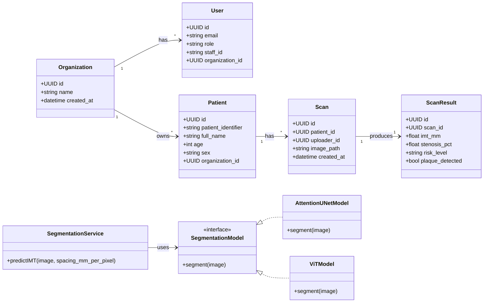
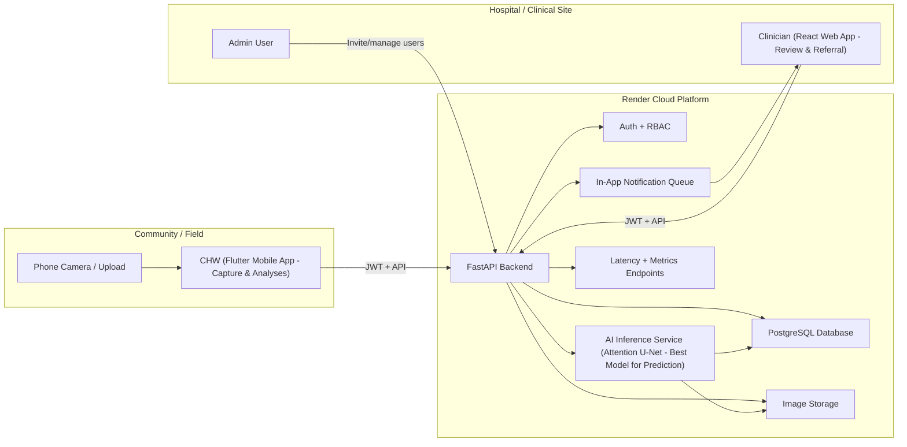
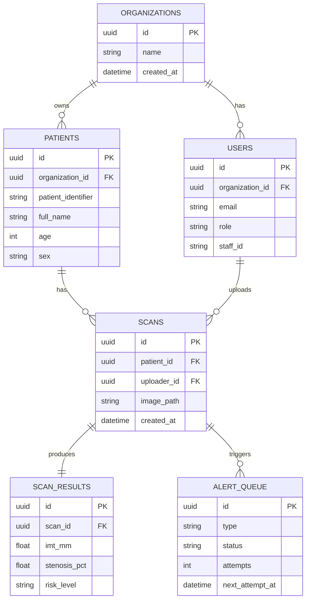

# Chapter 3 Diagrams (Single File)

## Figure 3.1: CarotidCheck UML Class Diagram

```mermaid
classDiagram
direction LR

class Organization {
  +UUID id
  +string name
  +datetime created_at
}

class User {
  +UUID id
  +string email
  +string role
  +string staff_id
  +UUID organization_id
}

class Patient {
  +UUID id
  +string patient_identifier
  +string full_name
  +int age
  +string sex
  +UUID organization_id
}

class Scan {
  +UUID id
  +UUID patient_id
  +UUID uploader_id
  +string image_path
  +datetime created_at
}

class ScanResult {
  +UUID id
  +UUID scan_id
  +float imt_mm
  +float stenosis_pct
  +string risk_level
  +bool plaque_detected
}

class SegmentationService {
  +predictIMT(image, spacing_mm_per_pixel)
}

class SegmentationModel {
  <<interface>>
  +segment(image)
}

class AttentionUNetModel {
  +segment(image)
}

class ViTModel {
  +segment(image)
}

Organization "1" --> "*" User : has
Organization "1" --> "*" Patient : owns
Patient "1" --> "*" Scan : has
Scan "1" --> "1" ScanResult : produces
SegmentationService --> SegmentationModel : uses
SegmentationModel <|.. AttentionUNetModel
SegmentationModel <|.. ViTModel
```

## Figure 3.2: Client-Server Architecture

```mermaid
flowchart LR
  subgraph Field["Community / Field"]
    CHW["CHW (Flutter Mobile App - Capture & Analyses)"]
    Device["Phone Camera / Upload"]
  end

  subgraph Hospital["Hospital / Clinical Site"]
    Clinician["Clinician (React Web App - Review & Referral)"]
    Admin["Admin User"]
  end

  subgraph Cloud["Render Cloud Platform"]
    API["FastAPI Backend"]
    Auth["Auth + RBAC"]
    Inference["AI Inference Service (Attention U-Net - Best Model for Prediction)"]
    DB["PostgreSQL Database"]
    Storage["Image Storage"]
    Alerts["In-App Notification Queue"]
    Metrics["Latency + Metrics Endpoints"]
  end

  Device --> CHW
  CHW -->|JWT + API| API
  Clinician -->|JWT + API| API
  Admin -->|Invite/manage users| API

  API --> Auth
  API --> Inference
  API --> DB
  API --> Storage
  API --> Alerts
  API --> Metrics

  Inference --> DB
  Inference --> Storage
  Alerts --> Clinician
```

## Figure 3.3: CarotidCheck Entity-Relationship Diagram (ERD)

```mermaid
erDiagram
  ORGANIZATIONS ||--o{ USERS : has
  ORGANIZATIONS ||--o{ PATIENTS : owns
  PATIENTS ||--o{ SCANS : has
  SCANS ||--|| SCAN_RESULTS : produces
  USERS ||--o{ SCANS : uploads
  SCANS ||--o{ ALERT_QUEUE : triggers

  ORGANIZATIONS {
    uuid id PK
    string name
    datetime created_at
  }
  USERS {
    uuid id PK
    uuid organization_id FK
    string email
    string role
    string staff_id
  }
  PATIENTS {
    uuid id PK
    uuid organization_id FK
    string patient_identifier
    string full_name
    int age
    string sex
  }
  SCANS {
    uuid id PK
    uuid patient_id FK
    uuid uploader_id FK
    string image_path
    datetime created_at
  }
  SCAN_RESULTS {
    uuid id PK
    uuid scan_id FK
    float imt_mm
    float stenosis_pct
    string risk_level
  }
  ALERT_QUEUE {
    uuid id PK
    string type
    string status
    int attempts
    datetime next_attempt_at
  }
```
